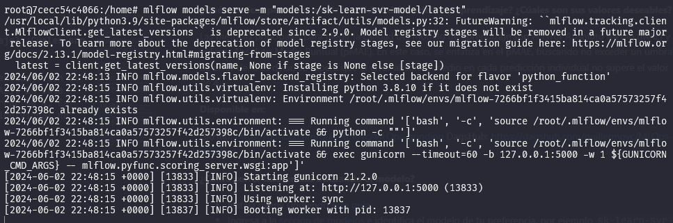
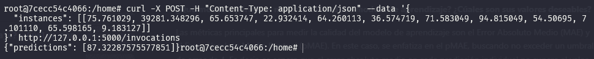

# Proyecto Machine Learning con datos de molienda SAG

Este proyecto forma parte de la materia de Machine Learning de la Maestría en Ciencia de Datos de la Universidad de Sonora. Se utilizan los datos de un molino SAG, los cuales fueron escalados.

**Integrantes del equipo**
* Misael González Soria.
* Guillermo Velázquez Coronado.
* Viow Yirmeiah Cabrisas Amuedo.

**¿Qué problema se plantea resolver?**

Para optimizar el control del nivel de llenado del molino, las variables controlables actuales necesitan ser complementadas con mediciones de variables externas a través de sensores inteligentes. Esto permitirá evitar que el molino opere con cargas extremadamente bajas o altas, lo que puede comprometer su eficiencia y seguridad.

El objetivo de este trabajo es identificar las relaciones entre estas variables adicionales para determinar los puntos de ajuste ideales. Estos puntos de ajuste asegurarán que el molino mantenga una presión óptima según lo deseado por el operador, mejorando así su rendimiento y prolongando su vida útil.

**¿Por qué es un problema importante para la institución/organización/empresa?**

El adecuado funcionamiento del molino SAG es crucial para la empresa minera debido a su significativo consumo energético. Cualquier mejora en su eficiencia o reducción en su uso se traduce en ahorros significativos para la compañía. Por lo tanto, resolver el problema de control del nivel de llenado del molino no solo optimiza su rendimiento, sino que también impacta directamente en los costos operativos de la minera.

**¿Cúales son las métricas para medir el impacto de la solución una vez obtenida?**

Las métricas para medir el impacto de la solución incluyen el Error Absoluto Medio (MAE), el cual se espera que sea de alrededor de 3 en una escala de datos escalados. Además, se establece un límite de error de 4 como máximo aceptable. Es importante tener en cuenta que estas métricas pueden resultar ambiciosas dada la calidad variable de algunas variables. No obstante, también se considerará positivo si se logra obtener una tendencia clara entre la presión predicha y la presión real.

**¿Qué problema de aprendizaje implica resolver?**

El problema de aprendizaje que se está abordando es de regresión. El objetivo es desarrollar un modelo que, a partir de datos históricos de variables de proceso y datos proporcionados por sensores inteligentes, pueda generar una función que mapee estas variables a la presión promedio en el molino SAG.

**¿Qué metricas permiten medir la calidad del modelo de aprendizaje? ¿Cúales son sus valores deseables?**

Las métricas principales para medir la calidad del modelo de aprendizaje son el Error Absoluto Medio (MAE) y el Error Absoluto Medio Puntual (pMAE). En este caso, se enfatiza en el pMAE, buscando no exceder un umbral de error de 4. Es decir, se espera que el error absoluto medio en cada predicción individual no supere el valor de 4.

**Disponible en:**

GitHub: https://github.com/guillermovc/MLOps-grinding
DagsHub: https://dagshub.com/guillermovc/MLOps-grinding


**¿Cómo correr inferencias utilizando el modelo?**
- Instala pyenv siguiendo [esta guia]( https://gist.github.com/trongnghia203/9cc8157acb1a9faad2de95c3175aa875).
- Ingresa a la [sección de modelos](https://dagshub.com/guillermovc/MLOps-grinding/models) e identifica el modelo de tu preferencia, por ejemplo `sk-learn-svr-model`.
- Exporta la variable de entorno `MLFLOW_TRACKING_URI` con el enlace de dagshub. En este caso sería `export MLFLOW_TRACKING_URI=https://dagshub.com/guillermovc/MLOps-grinding.mlflow`.
- Para descargar el modelo y encender el servidor, utiliza el siguiente comando: `mlflow models serve -m "models:/sk-learn-svr-model/latest"`.
- Ahora puedes hacer inferencias al modelo consultando la URL del servidor. Por ejemplo: ```curl -X POST -H "Content-Type: application/json" --data '{
  "instances": [[75.761029, 39281.348296, 65.653747, 22.932414, 64.260113, 36.574719, 71.583049, 94.815049, 54.50695, 7.101110, 65.598165, 9.183127]]
}' http://127.0.0.1:5000/invocations```.  
De igual forma, se ha añadido una libreta en `notebooks/SAAS_example.ipynb` para hacer solicitudes usando un script de python.
- Ejemplo del servidor escuchando

- Ejemplo de hacer una inferencia al servidor



**Solucionar posibles problemas al encender el servidor (pyenv)**
- Lista los entornos de `pyenv` con `pyenv versions`.
- De preferencia desinstala todos las versiones instaladas con el comando `pyenv uninstall <version>`
- De preferencia elimina los entornos previamente creados con el comando `rm -rf /root/.mlflow/envs/*`.
- Vuelve a instalar una versión de python con `pyenv`, se ha probado con la versión `3.8.10` y ha funcionado. Para instalar utiliza el comando `pyenv install 3.8.10`.
- Establece la versión instalada como la versión global para que se utilice al crear los entornos. `pyenv global 3.8.10`.
- Ahora intenta encender el servidor nuevamente.